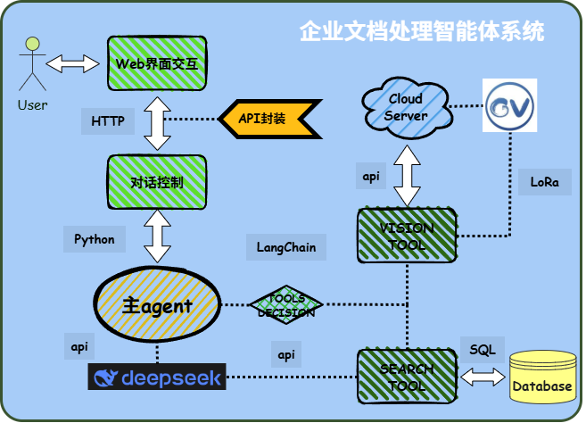
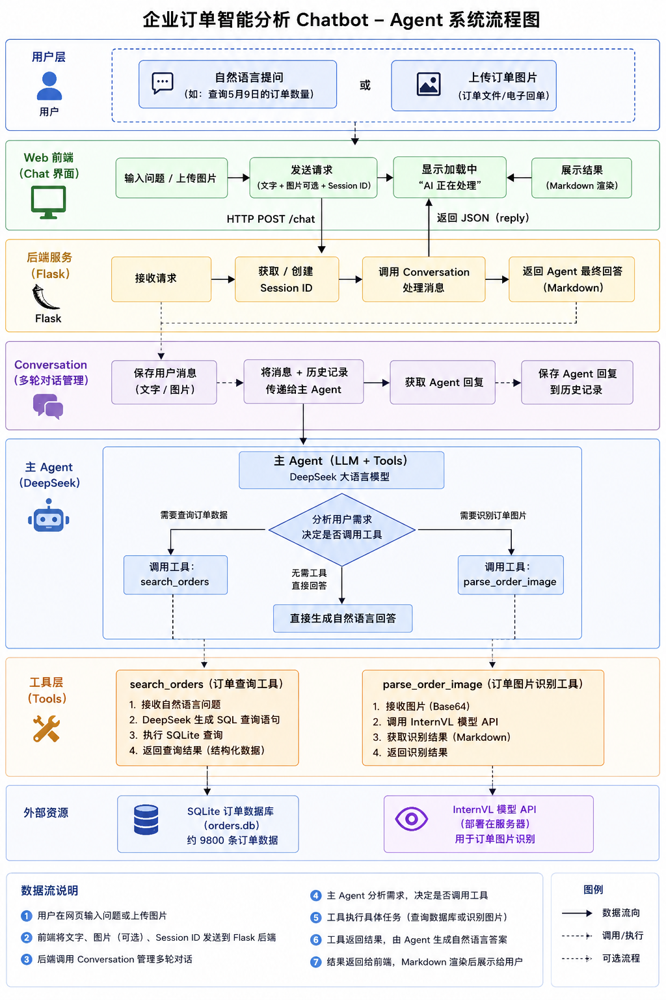
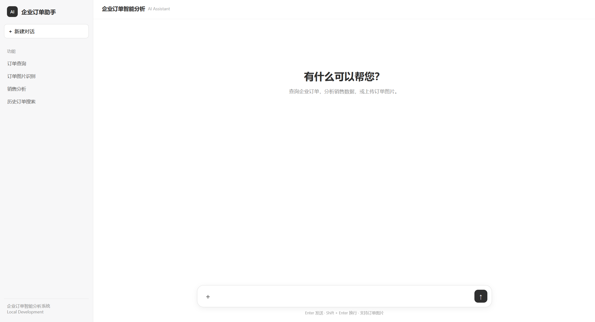
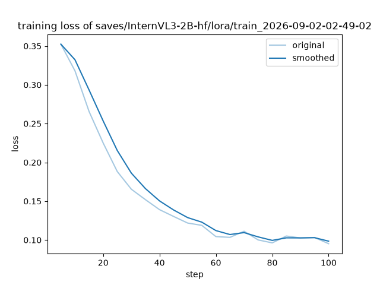

# 企业订单智能分析 Agent（Document Management Agent）

[English](README.md) | 简体中文


一个基于 **大语言模型（LLM）Agent** 的智能文档分析系统。系统以 LangChain 构建主 Agent，将**自然语言交互、结构化数据库查询、图片信息识别**整合为一体：用户用自然语言提问，Agent 自动判断意图、选择合适的工具，从数据库或视觉模型中获取真实结果后，以自然语言返回。

---

## 目录

- [功能特性](#功能特性)
- [系统架构](#系统架构)
- [工作流程](#工作流程)
- [项目结构](#项目结构)
- [快速开始](#快速开始)
- [模型微调](#模型微调)
- [技术栈](#技术栈)
- [License](#license)

---

## 功能特性

- 💬 **自然语言交互**：用户可直接用自然语言与智能体对话，表达查询需求
- 📊 **结构化数据查询**：Agent 将自然语言转换为 SQL，从 SQLite 数据库查询真实数据（支持按日期/公司/项目统计数量、金额、同比、环比、排名等）
- 🖼️ **图片信息识别**：上传订单/单据图片，Agent 调用经微调的 InternVL3 视觉大模型，自动提取关键字段信息
- 🧭 **智能工具选择**：主 Agent 根据用户意图自主选择工具，业务逻辑不写死在前端
- 💾 **多轮对话**：`Conversation` 会话管理模块保存历史消息，支持基于上下文的连续提问
- 🌐 **Web 交互**：基于 Flask 的本地网页端，支持文字输入、图片上传、Markdown 渲染

---

## 系统架构

系统整体采用分层 + 模块化设计，划分为**用户交互层、后端服务层、多轮对话管理层、主 Agent 层、工具层和数据资源层**：

- **用户交互层（Web）**：Flask + 原生前端，负责消息收发、图片上传与结果展示
- **后端服务层**：提供 `/chat`、`/clear` HTTP 接口，管理 Session 与上传文件
- **会话管理层**：`Conversation` 类维护消息历史，实现多轮对话
- **主 Agent 层**：LangChain `create_agent` + DeepSeek 大模型，负责意图理解与工具调度
- **工具层**：`search_orders`（数据库查询）、`parse_order_image`（图片识别）
- **数据资源层**：SQLite 数据库 + 微调后的 InternVL3 视觉模型 API（部署于远端 GPU 服务器）

<!-- TODO: 将系统架构图放入 docs/images/architecture.png -->
<p align="center">
  
  <br>
  <em>图 1 系统架构图</em>
</p>

---

## 工作流程

用户通过 Web 前端提交问题或上传图片，请求经 Flask 后端转发至 `Conversation` 会话管理模块，由主 Agent 统一分析意图并分流到对应工具：

- **数据查询类** → 调用 `search_orders`，将自然语言转为 SQL，从 SQLite 中检索信息
- **图片识别类** → 调用 `parse_order_image`，将图片 Base64 编码后请求 InternVL3 模型 API，提取关键字段

工具执行完成后将结果返回主 Agent，由主 Agent 整合并生成自然语言回答，最终经 Flask 封装为 JSON 返回前端展示，形成完整闭环。


<p align="center">
  
  <br>
  <em>图 2 系统工作流程</em>
</p>

<!-- TODO: 将网页端界面截图放入 docs/images/web_ui.png -->
<p align="center">
  
  <br>
  <em>图 3 网页端界面</em>
</p>

---

## 项目结构

> 以下结构对应公开仓库，未包含未公开上传的本地数据、配置与数据库文件；已省略 IDE 配置目录 `.idea`。

```
Document_management_agent/
├── agent/                          # Agent 核心
│   ├── chatbot.py                  # 主 Agent（LangChain + DeepSeek）
│   └── tools/
│       ├── search.py               # search_orders：自然语言 → SQL → 数据库查询
│       └── vision.py               # parse_order_image：图片信息识别
├── web/                            # Web 服务
│   ├── app.py                      # Flask 后端（/chat、/clear 接口）
│   └── index.html                  # 前端聊天页面
├── conversation.py                 # 多轮对话会话管理模块
├── data/                           # 数据集
│   ├── train/                      # 微调训练集图片
│   ├── val/                        # 微调验证集图片
│   └── output_label.xlsx.txt       # 标注数据示例
├── scripts/                        # 工具脚本
│   ├── gen_sharegpt.py             # 生成 ShareGPT 格式微调数据
│   ├── excel_to_sqlite.py          # Excel → SQLite 数据导入
│   ├── api_test.py                 # 视觉模型 API 调用测试
│   └── 2base64.py                  # 图片转 Base64
├── train_2026-09-01-00-13-03/      # LoRA 微调输出（第一轮）
├── train_2026-09-02-02-49-02/      # LoRA 微调输出（最终轮）
├── sample.json                     # 单条微调数据样例
├── README.md                       # 项目说明（英文）
├── README.zh-CN.md                 # 项目说明（中文）
├── requirements.txt                # Python 依赖清单
└── .gitignore
```

---

## 快速开始

### 环境要求

- Python 3.10+
- 需要可访问的 **DeepSeek API Key**
- 图片识别需要远端部署的 **InternVL3 视觉模型 API**（本机需能访问该服务）

### 1. 安装依赖

```bash
pip install -r requirements.txt
```

### 2. 配置环境变量

在 `agent/.env` 中配置 DeepSeek API Key：

```bash
DEEPSEEK_API_KEY=sk-xxxxxx
```

> 说明：`agent/tools/vision.py` 中的 `INTERNVL_API_URL`（默认 `http://localhost:5006/v1/chat/completions`）需指向你部署的 InternVL3 模型服务地址。

### 3. 准备数据库与数据

数据库与数据集涉及业务数据，**未随仓库提供**。请按 `scripts/excel_to_sqlite.py` 的说明，自行准备标注 Excel 文件后重建 SQLite 数据库：

```bash
python scripts/excel_to_sqlite.py
```

该脚本会对标注数据进行清洗（去除货币符号、千位分隔符，自动计算金额字段）并导入 SQLite。

### 4. 启动 Web 服务

```bash
python web/app.py
```

浏览器访问 <http://127.0.0.1:5000> 即可开始对话。

**示例提问：**

- 「查询某日的订单数量」
- 「各项目销售金额排名前 5」
- 上传图片：「帮我识别这张单据图片的信息」

---

## 模型微调

图片信息识别基于 **InternVL3-2B** 视觉大模型，使用 **LLaMA-Factory** 进行 **LoRA 微调（SFT）**，使其更适配单据信息提取场景。微调后通过 LLaMA-Factory 的 API 服务将模型包装为可 URL 访问的接口，供 Agent 工具调用。

**微调要点：**

| 配置项 | 取值 |
| --- | --- |
| 基础模型 | `OpenGVLab/InternVL3-2B-hf` |
| 微调框架 | LLaMA-Factory |
| 微调方式 | LoRA（`lora_rank=8`，`lora_alpha=16`） |
| 训练阶段 | SFT |
| 数据集 | ShareGPT 格式（训练集 / 验证集） |
| 学习率 | 5e-5（cosine 调度） |
| 训练轮数 | 4 |
| 精度 | bf16 |

**评估结果（最终模型）：**

| 指标 | 早期评估 | 最终模型 |
| --- | --- | --- |
| BLEU-4 | 30.78 | **60.06** |
| ROUGE-1 | 48.87 | **73.78** |
| ROUGE-2 | 28.25 | **62.08** |
| ROUGE-L | 42.69 | **70.10** |

微调后各评估指标均有明显提升，训练损失由 0.263 降至 0.155。

<!-- TODO: 将训练损失曲线/评估指标图放入 docs/images/training_loss.png -->
<p align="center">
  
  <br>
  <em>图 5 最终模型训练损失曲线</em>
</p>

---

## 技术栈

| 类别 | 技术 |
| --- | --- |
| 主 Agent | LangChain（`create_agent`）、DeepSeek（`deepseek-chat`） |
| 视觉模型 | InternVL3-2B（LLaMA-Factory LoRA 微调） |
| 后端服务 | Flask |
| 数据库 | SQLite |
| 数据处理 | pandas、openpyxl |
| 其他 | python-dotenv、requests、tqdm |

---

## License

[MIT](LICENSE)
